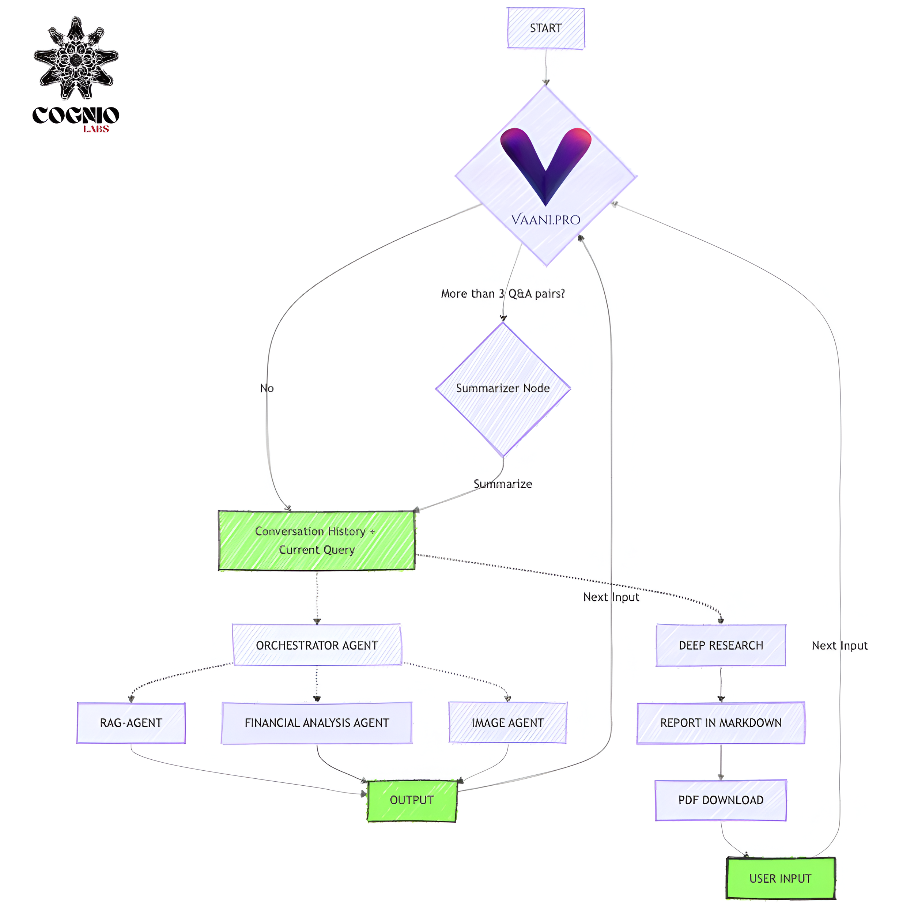

# Vaani.pro RAG Research Agent


An intelligent multi-agent system powered by Qdrant vector search that combines RAG, financial analysis, and image processing capabilities. Built using LangGraph and LangChain, this system orchestrates multiple specialized agents to provide comprehensive responses to complex queries.

> **Created by Ashutosh Upadhyay (Cognio Labs)**



## Architecture Overview

The system consists of several key components:

1. **Conversation Management**
   - Maintains conversation history and current query context
   - Implements summarization for conversations with more than 3 Q&A pairs
   - Ensures contextual continuity across interactions

2. **Orchestrator Agent**
   - Central coordinator that delegates tasks to specialized agents:
     - RAG Agent: Handles document retrieval and knowledge-based responses
     - Financial Analysis Agent: Processes financial queries and data
     - Image Agent: Manages image-related tasks and analysis

3. **Deep Research Pipeline**
   - Triggered for complex queries requiring in-depth analysis
   - Generates detailed markdown reports
   - Provides PDF download capability for research outputs

4. **Vector Search Integration**
   - Powered by Qdrant for efficient document retrieval
   - Enables semantic search across indexed content
   - Supports real-time updates and queries

---

## Features

- **Multi-Agent Orchestration:** Coordinates between specialized agents for comprehensive responses
- **Adaptive Summarization:** Automatically condenses long conversations while preserving context
- **Deep Research Capabilities:** Generates detailed reports for complex queries
- **Document Management:** Powered by Qdrant vector database for efficient storage and retrieval
- **Multiple Output Formats:** Supports both immediate responses and detailed PDF reports

---

## Prerequisites

- **Python 3.9+**: Required for running the project
- **Qdrant Instance:**  
  - **Local Setup (Docker):**  
    ```bash
    docker run -p 6333:6333 -v $(pwd)/qdrant_storage:/qdrant/storage qdrant/qdrant
    ```
  - **Cloud Setup:** Sign up for [Qdrant Cloud](https://cloud.qdrant.io/)

- **API Keys:** Required for various services:
  - Qdrant API key (for cloud deployment)
  - LLM API keys (Anthropic/OpenAI)
  - Additional keys based on enabled features

---

## Installation

1. **Clone the Repository:**
   ```bash
   git clone https://github.com/cogniolabs/vaani-pro.git
   cd vaani-pro
   ```

2. **Install Dependencies:**
   ```bash
   python -m venv venv
   source venv/bin/activate   # On Windows: venv\Scripts\activate
   pip install -e .
   ```

---

## Configuration

Create a `.env` file:

```dotenv
# Qdrant Configuration
QDRANT_URL=http://localhost:6333
QDRANT_API_KEY=your_qdrant_api_key  # Required for cloud deployment

# LLM API Keys
ANTHROPIC_API_KEY=your_anthropic_api_key
OPENAI_API_KEY=your_openai_api_key

# Additional Service Keys (as needed)
# FINANCIAL_API_KEY=your_financial_api_key
# IMAGE_PROCESSING_API_KEY=your_image_api_key
```

---

## Using the System

### Starting a Conversation

1. **Initialize the System:**
   ```bash
   python -m langgraph.run --graph vaani_pro
   ```

2. **Input Your Query:**
   - The system automatically routes your query to appropriate agents
   - For complex queries, it triggers the deep research pipeline
   - Responses can be immediate or detailed reports based on query complexity

### Document Management

1. **Index New Documents:**
   ```bash
   python -m langgraph.run --graph indexer
   ```

2. **Document Format:**
   ```json
   [
     {
       "page_content": "Your document content here",
       "metadata": {
         "type": "financial_report",
         "date": "2024-03-20"
       }
     }
   ]
   ```

---

## Development and Customization

- **Agent Customization:**  
  Modify agent behaviors in their respective directories:
  - `src/rag_agent/`
  - `src/financial_agent/`
  - `src/image_agent/`

- **Orchestrator Logic:**  
  Update routing and coordination in `src/orchestrator/`

- **Testing:**  
  ```bash
  make test
  make integration_tests
  ```

---

## Credits

This agent was created by **Ashutosh Upadhyay from Cognio Labs**. It showcases advanced multi-agent orchestration using LangGraph and LangChain, with Qdrant providing robust vector search capabilities.

---

## License

This project is licensed under the MIT License. See the [LICENSE](./LICENSE) file for details.
